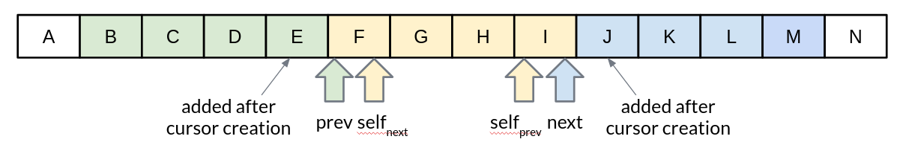

# Best practices

The best practices presented in this section are not part of the actual
guidelines, but should provide guidance for common challenges we face when
implementing RESTful APIs.


## Cursor-based pagination in RESTful APIs

Cursor-based pagination is a very powerful and valuable technique (see also
[#160](pagination.md#rule-160)) that allows to efficiently provide a stable view on changing data.
This is obtained by using an anchor element that allows to retrieve all page
elements directly via an ordering index, usually based on `created_at` or
`modified_at` in combination with a tie breaker, mostly the resource `id` or a
unique `key`. In addition, the cursor contains all other information needed
to reconstruct a database query that retrieves a minimal information set from
the data storage to create a response page.

The `cursor` itself is an opaque string, transmitted forth and back between
service and clients, that must never be *inspected* or *constructed* by
clients. Therefore, it is good practice to encode (encrypt) its content in a
non-human-readable form.

The `cursor` content usually consists of a pointer to the anchor element
defining the page position in the collection, a flag whether the anchor element
is included or excluded into/from the page, the retrieval direction, and a hash
over the applied query filters (or the query filter itself) to safely re-create
the collection.

The `cursor` is usually defined as an encoding of the following information:

```yaml
Cursor:
  descriptions: >
    Cursor structure that contains all necessary information to efficiently
    retrieve a page from the data store.
  type: object
  properties:
    position:
      description: >
        Object containing the keys pointing to the anchor element that is
        defining the collection resource page. Normally the position is given
        by the first or the last page element. The position object contains all
        values required to access the element efficiently via the ordered,
        combined index, e.g `modified_at`, `id`.
      type: object
      properties: ...

    element:
      description: >
        Flag whether the anchor element, which is pointed to by the `position`,
        should be *included* or *excluded* from the result set. Normally, only
        the current page includes the pointed to element, while all others are
        exclude it.
      type: string
      enum: [ INCLUDED, EXCLUDED ]

    direction:
      description: >
        Flag for the retrieval direction that is defining which elements to
        choose from the collection resource starting from the anchor elements
        position. It is either *ascending* or *descending* in relation to the
        ordering index - usually in sync with the pagination direction.
      type: string
      enum: [ ASCENDING, DESCENDING ]

    query_hash:
      description: >
        Stable hash calculated over all query filters applied to create the
        collection resource that is represented by this cursor.
      type: string

    query:
      description: >
        Object containing all query filters applied to create the collection
        resource that is represented by this cursor.
      type: object
      properties: ...

  required:
    - position
    - element
    - direction
```

It is important to note, that `cursor` should always point to the last or first
element of the current page - also `next` and `prev` cursors, depending on the
retrieval direction. This allows the pagination to react on db-changes when
(re-)evaluating a cursor, e.g. when elements are added or removed after the
cursor was created.



| Cursor | Position | Element | Direction |
|---|---|---|---|
| prev | F | EXCLUDED | DESCENDING |
| self<sub>next</sub> | F | INCLUDED | ASCENDING |
| self<sub>prev</sub> | I | INCLUDED | DESCENDING |
| next | I | EXCLUDED | ASCENDING |

**Remark:** In case of complex and long search requests, e.g. when
`GET` with body is already required, the `cursor` may not be able to include
the `query` because of common HTTP parameter size restrictions. In this case
the `query` filters should be transported via body - in the request as well as
in the response, while the pagination consistency should be ensured via the
`query_hash`.

**Note:** The efficiency of cursor-based pagination depends on the efficiency
of the ordering index. In most cases a single ordering index, e.g. based on
`modified_at` is sufficient. Only in case of a low selectivity a combined
index including the `id` or other filter criteria is needed. This should be
carefully evaluated regularly on a case-by-case basis to avoid unnecessary
complexity but also to avoid scalability and performance issues.

### Example

A real-world example can be found in an internal API repository.

- The actual `cursor` implementation can vary from the above pattern by using a
  cursor-`type` instead of `element` to simplify cursor representation following
  the above figure.
- The `cursor` is passed down to the data access object implementation to create
  the SQL request.

The API repository, in this case does not need any combined index, since the
primary ordering based on `modified_at` allows to efficiently access the data
in combination with the additional filter criteria such as `states`, `teams`,
and `applications`.

### Further reading

- [Twitter](https://dev.twitter.com/rest/public/timelines)
- [Use the Index, Luke](http://use-the-index-luke.com/no-offset)
- [Paging
  in PostgreSQL](https://www.citusdata.com/blog/1872-joe-nelson/409-five-ways-paginate-postgres-basic-exotic)


## Optimistic locking in RESTful APIs

### Introduction
Optimistic locking might be used to avoid concurrent writes on the same entity,
which might cause data loss. A client always has to retrieve a copy of an
entity first and specifically update this one. If another version has been
created in the meantime, the update should fail. In order to make this work,
the client has to provide some kind of version reference, which is checked by
the service, before the update is executed. Please read the more detailed
description on how to update resources via `PUT` in the *HTTP Requests
Section*.

A RESTful API usually includes some kind of search endpoint, which will then
return a list of result entities. There are several ways to implement
optimistic locking in combination with search endpoints which, depending on the
approach chosen, might lead to performing additional requests to get the
current version of the entity that should be updated.

### `ETag` with `If-Match` header
An `ETag` can only be obtained by performing a `GET` request on the single
entity resource before the update, i.e. when using a search endpoint an
additional request is necessary.

Example:
```http
< GET /orders

> HTTP/1.1 200 OK
> {
>   "items": [
>     { "id": "O0000042" },
>     { "id": "O0000043" }
>   ]
> }

< GET /orders/BO0000042

> HTTP/1.1 200 OK
> ETag: osjnfkjbnkq3jlnksjnvkjlsbf
> { "id": "BO0000042", ... }

< PUT /orders/O0000042
< If-Match: osjnfkjbnkq3jlnksjnvkjlsbf
< { "id": "O0000042", ... }

> HTTP/1.1 204 No Content
```

Or, if there was an update since the `GET` and the entity's `ETag` has changed:

```http
> HTTP/1.1 412 Precondition failed
```

#### Pros
- RESTful solution

#### Cons
- Many additional requests are necessary to build a meaningful front-end

### `ETags` in result entities
The ETag for every entity is returned as an additional property of that entity.
In a response containing multiple entities, every entity will then have a
distinct `ETag` that can be used in subsequent `PUT` requests.

In this solution, the `etag` property should be `readonly` and never be expected
in the `PUT` request payload.

Example:
```http
< GET /orders

> HTTP/1.1 200 OK
> {
>   "items": [
>     { "id": "O0000042", "etag": "osjnfkjbnkq3jlnksjnvkjlsbf", "foo": 42, "bar": true },
>     { "id": "O0000043", "etag": "kjshdfknjqlowjdsljdnfkjbkn", "foo": 24, "bar": false }
>   ]
> }

< PUT /orders/O0000042
< If-Match: osjnfkjbnkq3jlnksjnvkjlsbf
< { "id": "O0000042", "foo": 43, "bar": true }

> HTTP/1.1 204 No Content
```

Or, if there was an update since the `GET` and the entity's `ETag` has changed:

```http
> HTTP/1.1 412 Precondition failed
```

#### Pros
- Perfect optimistic locking

#### Cons
- Information that only belongs in the HTTP header is part of the business
  objects

### Version numbers
The entities contain a property with a version number. When an update is
performed, this version number is given back to the service as part of the
payload. The service performs a check on that version number to make sure it
was not incremented since the consumer got the resource and performs the
update, incrementing the version number.

Since this operation implies a modification of the resource by the service, a
`POST` operation on the exact resource (e.g. `POST /orders/O0000042`) should be
used instead of a `PUT`.

In this solution, the `version` property is not `readonly` since it is provided
at `POST` time as part of the payload.

Example:
```http
< GET /orders

> HTTP/1.1 200 OK
> {
>   "items": [
>     { "id": "O0000042", "version": 1,  "foo": 42, "bar": true },
>     { "id": "O0000043", "version": 42, "foo": 24, "bar": false }
>   ]
> }

< POST /orders/O0000042
< { "id": "O0000042", "version": 1, "foo": 43, "bar": true }

> HTTP/1.1 204 No Content
```

or if there was an update since the `GET` and the version number in the
database is higher than the one given in the request body:

```http
> HTTP/1.1 409 Conflict
```

#### Pros
- Perfect optimistic locking

#### Cons
- Functionality that belongs into the HTTP header becomes part of the
  business object
- Using `POST` instead of PUT for an update logic (not a problem in itself,
  but may feel unusual for the consumer)

### `Last-Modified` / `If-Unmodified-Since`
In HTTP 1.0 there was no `ETag` and the mechanism used for optimistic locking
was based on a date. This is still part of the HTTP protocol and can be used.
Every response contains a `Last-Modified` header with a HTTP date. When
requesting an update using a `PUT` request, the client has to provide this
value via the header `If-Unmodified-Since`. The server rejects the request, if
the last modified date of the entity is after the given date in the header.

This effectively catches any situations where a change that happened between
`GET` and `PUT` would be overwritten. In the case of multiple result entities,
the `Last-Modified` header will be set to the latest date of all the entities.
This ensures that any change to any of the entities that happens between `GET`
and `PUT` will be detectable, without locking the rest of the batch as well.

Example:
```http
< GET /orders

> HTTP/1.1 200 OK
> Last-Modified: Wed, 22 Jul 2009 19:15:56 GMT
> {
>   "items": [
>     { "id": "O0000042", ... },
>     { "id": "O0000043", ... }
>   ]
> }

< PUT /block/O0000042
< If-Unmodified-Since: Wed, 22 Jul 2009 19:15:56 GMT
< { "id": "O0000042", ... }

> HTTP/1.1 204 No Content
```

Or, if there was an update since the `GET` and the entities last modified is
later than the given date:

```http
> HTTP/1.1 412 Precondition failed
```

#### Pros
- Well established approach that has been working for a long time
- No interference with the business objects; the locking is done via HTTP
  headers only
- Very easy to implement
- No additional request needed when updating an entity of a search endpoint
  result

#### Cons
- If a client communicates with two different instances and their clocks are
  not perfectly in sync, the locking could potentially fail

### Conclusion
We suggest to either use the *`ETag` in result entities* or *`Last-Modified`
/ `If-Unmodified-Since`* approach.


## Handling compatible API extensions

### In the clients

Client must not eliminate unknown optional fields from the
fetched resource payload, and to serialize them later when submitting the
complete resource payload back to the API server via `PUT` ([#108](compatibility.md#rule-108)).

When using Java with Jackson serialization, for example, that can be achieved
by including a field in the Java class representing the API resource, like the
following one:

```java
@JsonAnyGetter
@JsonAnySetter
private Map<String, JsonNode> additionalProperties = new HashMap<>();
```

## Implementing Intervals in RESTful APIs

Unfortunately the out-of-the-box library support for open intervals in most
programming languages is very limited. As a consequence, you will likely need
to implement your own parser for ISO 8601 compliant intervals, which also supports open boundaries using `..`. The following sections provide example implementations for Java/Kotlin/Scala, Go, and Python.

### In Java/Kotlin/Scala

In Java/Kotlin/Scala you can use the Time4J library, which provides
a powerful and flexible API for working with date and time, including support
for intervals. However, it does not provide a built-in parser for ISO 8601 compliant intervals, but a custom format using `-` to signal open ends.

A common approach to implement ISO 8601 compliant interval parsing is to use regular expressions to identify and transform the input string into the format expected by Time4J. Below is an example implementation of such a parser:

```java
import java.util.regex.Pattern;
import net.time4j.range.MomentInterval;
import org.slf4j.Logger;
import org.slf4j.LoggerFactory;

public class IntervalParser {
    private static final Logger log = 
        LoggerFactory.getLogger(IntervalParser.class);

    // Pre-compile the patterns for performance
    private static final Pattern ISO_INCOMPLIANT_INTERVAL = 
        Pattern.compile("(^-/|/-$)");
    private static final Pattern ISO_OPEN_START_INTERVAL = 
        Pattern.compile("^(\\.\\.)?/");        
    private static final Pattern ISO_OPEN_END_INTERVAL = 
        Pattern.compile("/(\\.\\.)?$");

    public MomentInterval parseDateTimeInterval(String interval) {
        if (ISO_INCOMPLIANT_INTERVAL.matcher(interval).find()) {
            return null;
        }

        try {
            // Apply the regex replacements sequentially
            String formattedInterval = ISO_OPEN_START_INTERVAL
                .matcher(interval).replaceAll("-/");
                
            formattedInterval = ISO_OPEN_END_INTERVAL
                .matcher(formattedInterval).replaceAll("/-");
            
            return MomentInterval.parseISO(formattedInterval);
            
        } catch (Exception except) {
            log.debug("parsing interval failed", except);
            return null;
        }
    }
}
```

### In Go

In Go, the approach is a bit more complex, since there is no built-in library
for intervals and we also need to implement the parsing logic for ISO 8601
durations due to the lack of native duration support. Below is an example
implementation of an ISO 8601 compliant interval and duration parser in Go:

```go
package interval

import (
	"fmt"
	"regexp"
	"strconv"
	"strings"
	"time"
)

type MomentInterval struct {
	Start *time.Time
	End   *time.Time
}

// Regex to extract Days, Hours, Minutes, and Seconds from an ISO duration (e.g., P6DT2H5M)
var durationRegex = regexp.MustCompile(`^P(?:(\d+)D)?(?:T(?:(\d+)H)?(?:(\d+)M)?(?:(\d+)S)?)?$`)

// parseISODuration converts an ISO duration string into a native time.Duration
func parseISODuration(str string) (time.Duration, error) {
	matches := durationRegex.FindStringSubmatch(str)
	if matches == nil {
		return 0, fmt.Errorf("invalid or unsupported ISO duration")
	}

	var total time.Duration

	// Note: We only parse exact time units (Days, Hours, Minutes, Seconds).
	if matches[1] != "" { // Days (assumed 24 hours for machine-time math)
		d, _ := strconv.Atoi(matches[1])
		total += time.Duration(d) * 24 * time.Hour
	}
	if matches[2] != "" { // Hours
		h, _ := strconv.Atoi(matches[2])
		total += time.Duration(h) * time.Hour
	}
	if matches[3] != "" { // Minutes
		m, _ := strconv.Atoi(matches[3])
		total += time.Duration(m) * time.Minute
	}
	if matches[4] != "" { // Seconds
		s, _ := strconv.Atoi(matches[4])
		total += time.Duration(s) * time.Second
	}

	return total, nil
}

func ParseDateTimeInterval(interval string) *MomentInterval {
	parts := strings.Split(interval, "/")
	if len(parts) != 2 {
		return nil
	}

	startStr := parts[0]
	endStr := parts[1]

	if startStr == "-" || endStr == "-" {
		return nil
	}

	result := &MomentInterval{}

	// Identify if either side is a duration (starts with 'P')
	isStartDuration := strings.HasPrefix(startStr, "P")
	isEndDuration := strings.HasPrefix(endStr, "P")

	// An interval cannot be made of two durations
	if isStartDuration && isEndDuration {
		return nil
	}

	// 1. Parse the Start boundary (if it is a timestamp or open)
	if !isStartDuration && startStr != "" && startStr != ".." {
		if t, err := time.Parse(time.RFC3339, startStr); err != nil {
			return nil
		}
		result.Start = &t
	}

	// 2. Parse the End boundary (if it is a timestamp or open)
	if !isEndDuration && endStr != "" && endStr != ".." {
		if t, err := time.Parse(time.RFC3339, endStr); err != nil {
			return nil
		}
		result.End = &t
	}

	// 3. Resolve Durations
	if isStartDuration {
		// Duration/End scenario -> Calculate Start
		if result.End == nil {
			return nil // Cannot subtract a duration from an open/infinite end
		} else if d, err := parseISODuration(startStr); err != nil {
			return nil
		}
		t := result.End.Add(-d)
		result.Start = &t

	} else if isEndDuration {
		// Start/Duration scenario -> Calculate End
		if result.Start == nil {
			return nil // Cannot add a duration to an open/infinite start
		} else if d, err := parseISODuration(endStr); err != nil {
			return nil
		}
		t := result.Start.Add(d)
		result.End = &t
	}

	return result
}
```

### In Python

In Python, the approach is more straightforward, since there are libraries like
`aniso8601`, that provide built-in support for parsing ISO 8601 compliant
intervals without open boundaries (".."). Below is an example implementation of
how such a parser can be used to implement ISO 8601 compliant interval parsing
in Python, including handling of open boundaries:

```python
import aniso8601
from datetime import datetime
from typing import Optional, Tuple

def parse_datetime_interval(interval: str) -> Optional[Tuple[datetime, datetime]]:
    if interval.startswith("-/") or interval.endswith("/-"):
        return None

    try:
        # 2. Intercept open boundaries ("..") manually
        if interval.startswith("../"):
            end_str = interval.split("/")[1].replace("Z", "+00:00")
            return (None, datetime.fromisoformat(end_str))
            
        if interval.endswith("/.."):
            start_str = interval.split("/")[0].replace("Z", "+00:00")
            return (datetime.fromisoformat(start_str), None)

        # 3. THE SHORTCUT: aniso8601 handles Start/End, Start/Duration, and
        # Duration/End! (We use sorted() because if the string is Duration/End,
        # aniso8601 returns the tuple backwards as (End, Start))
        start, end = sorted(aniso8601.parse_interval(interval))
        
        return (start, end)
        
    except Exception:
        return None
```
